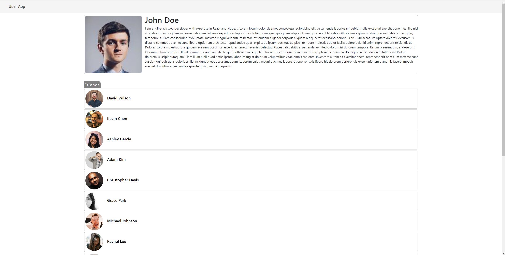

## Table of contents

- [General info](#general-info)
- [Technologies](#technologies)
- [Setup](#setup)
- [Website functionalities](#Website-functionalities)

## General info

user list website, where you can see users list and view their detailed info, website has infinite scrolling function which is implemented using intersectionObserver ,which is native JavaScript API that enables us to observe an element and detect when it passes a specified point in a scrolling container .

## Technologies

The project is created with:

- Angular 15
- typescript
- Angular material
- bootstrap

## Setup

To run this project, run following commands.

```
$ npm install
$ ng serve
$ json-server --watch db.json

```

## Website functionalities

- View page

  when you first visit the website, the initial page looks like this.
  

  header has a link to home page, you can use it to return to home page.
  in view users are displayed on cards, initially 2 user are loaded, but if last card is visible, more cards will be loaded, until last card is not in view.
  by scrolling down, and revealing more cards, more cards will be loaded.
  website uses loading interceptor and has delay for http requests to make loading of cards more visible.


- user page

  when navigating to user page by clicking on cards you will be taken to user page
  

  User page displays user's detailed information and their friend list, friend list has infinite scroll too.
  initially 2 friends are loaded, but if more friends are visible in view, more friends objects get fetched from database, until last friend item is not in view.
  by clicking on friend item you will be taken to new user page where friend's detailed information and their friend list will be displayed.
  by navigating new tab is not opened, but route changes and user page component collects new data with route.params to load data dynamically.
